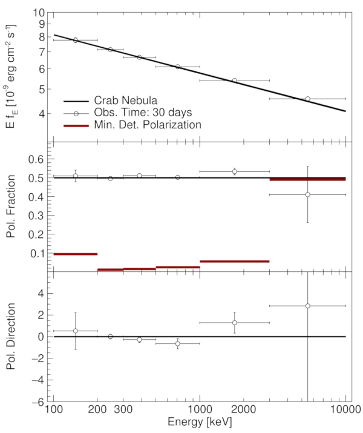

# The Gamma-ray Polarimetry Simulation Toolkit
*By Fabian Kislat and Henric Krawczynski*

___

The Gamma-ray Polarimetry Simulation Toolkit (GPST) is a simple tool to
simulate observations of polarized gamma-ray sources with AMEGO. It relies
on detector response parametrizations obtained with other software (e.g.
MEGALIB). GPST was originally developed for the PolSTAR hard X-ray polarimeter
proposal and called XST (X-Calibur Simulation Toolkit) since it was written
before the name PolSTAR was introduced. All code is contained in a single ROOT
script and no installation is required.

## Running GPST
For convenience, a wrapper shell script calls ROOT with all necessary
parameters. In the simplest case, the only argument to that shell script
is a model file in the format described below. To run one of the example files
included with GPST, execute from the GPST source directory:

```
$ ./gpst.sh dataCrab-Simple.gpst
```

This should start ROOT, compile the file `gpst.C` and run the simulation. The
final product is a figure containing the model and simulated data similar to
this one:



On the terminal you will have a ROOT prompt. You can save the figure by simply 
typing

```
root [1] save()
```

which will create the files `canvasCrab-Simple.root` and `canvasCrab-Simple.eps`
in the current directory. The first is a ROOT file that allows opening the
figure in ROOT at a later time for editing, the second is a vector graphic that
can be converted into other formats and used in LaTeX typeset publications.

When you are done, exit ROOT by typing

```
root [2] .q
```

The script `gpst.sh` has a few more command line options, which are mostly of
interest for debugging purposes when developing GPST. You can print a list of
all options:

```
$ ./gpst.sh -h
This is the Gamma-ray Polarimetry Simulation Toolkit version 14.2 (03/27/2018)

Usage:
    ./gpst.sh [-h] [-v] [-c] [-l] [-g] [-f|++] input_file
Parameters:
    -h   Print this help text and exit
    -v   Print version number and exit
    -c   Clean. Do not print version number and date on the plot
    -l   Large labels
    -g   Turn on debugging (both debug output from the script
         and debug compiler options)
    ++   Force recompilation (same as -f)
    -f   Force recompilation (same as ++)
    input_file
         File with model and simulation parameters
A detailed manual can be found at
    https://sites.physics.wustl.edu/xcalibur/wiki/index.php/X-Calibur_observation_simulation_code
```


## Required inputs
### The GPST config file format
GPST input files are text files in which values are assigned to keywords in
the format `key = value` with one assignment per line. Comments start with
a semicolon (`;`) and last until the end of the line.

For example:

```
modulationfile = "modulation.AMEGO.txt"
ontime = 0.1  ; Estimated fraction of time target is in field of view
```

Values on the right-hand side can be:

* Integer and floating point numbers,
* Strings in double quotes (`"`),
* Arrays of numbers, i.e. space-separated lists of floating point numbers
enclosed in square brackets (`[]`),
* The boolean values `true` and `false`,
* Pre-defined constants.

Note that arrays may be broken into multiple lines for improved readability.

Only assignments to predefined keywords are possible, i.e. user-defined 
variables cannot be created. In most cases the last value assigned to a
keyword will be used in the simulation. However, several keywords support
multiple assignments, and in some cases the order of assignments matters.
More details will be given in the detailed description of keywords.

There are two exceptions to the `key=value`-format:

1. The first line of the input file passed to GPST on the command line must
start with the string

   ```
   GPST 14
   ```

   This identifies the file as a GPST input file and identifies the GPST
   version (only major version). This allows correctly handling files created
   for older versions of GPST. Comments and blank lines are allowed prior to
   this header line.
   
2. Other files can be included verbatim like this:

   ```
   @include "file.txt"
   ```
   
   Note that files included in this way *must not* have a ```GPST 14``` header
   file and that they will be interpreted with the same assumptions on the
   GPST version as the main input file. Hence, never mix files created for
   different versions of GPST.
   
   The `@include` statement supports the use of environment variables by
   prefixing the variable name with a dollar sign (`$`):
   
   ```
   @include "$GPST_DATA_DIR/amego.det"
   ```
   
   Variable names can contain alphanumeric characters and the underscore (`_`).
   Note that enclosing the variable name in braces as in Bash is currently
   *not* supported.
   
   The environment variable `$GPST_DATA_DIR` is set by `gpst.sh` to the 
   directory where `gpst.sh` is located.


### Detector description
GPST includes a detector description file for AMEGO, called `amego.det`, which
sets up simulations for AMEGO. This file must be included in all simulation
input files and is written in the same configuration file syntax. In particular,
it points the code to the files describing the detector sensitivity:
"signal.AMEGO.txt" (parameter `sensitivityfile`), "background.AMEGO.txt"
(parameter `backgroundfile`), and "modulation.AMEGO.txt" (parameter
`modulationfile`). Each of these files is a space separated list of 9900
floating point numbers, one for each 1keV bin in the energy range 100keV&mdash;10MeV.
This range is defined by the parameters `detectoremin`, `detectordeltae`, and
`detectornbins`.

* **sensitivityfile** &mdash; "Crab" event rate for AMEGO within each energy bin.
Internally, GPST converts all models into the "Crab flux",

   

   Effectively, this is just a reference flux (used due to the PolSTAR heritage)
   and does not have any relation to the actual Crab flux in the AMEGO energy
   range.
* **backgroundfile** &mdash; Background count rate in each energy bin, obtained by
interpolating the more coarsely binned MEGALIB simulations.
* **modulationfile** &mdash; Modulation factor in each energy bin.

Additionally, the detector file defines the following parameters:

* **referencerange** &mdash; Energy range in keV that is used when rescaling model
fluxes.
* **ontime** &mdash; Fraction of time the target is assumed to be in the field of
view of the detector. Currently assumed to be 10%.


### Simulation input file
The simulation input file defines the model(s) to be simulated and various
parameters of the layout of the figure being produced by GPST. Every input
file starts with the line

```
GPST 14
```

followed by several mandatory and optional `key=value` assignments. Mandatory
keywords are:

* **sensitivityfile**, **backgroundfile**, **modulationfile** &mdash; Detector
sensitivity files described in the previous section. Usually, this is taken
care of by including the AMEGO detector config:

   ```
   @include "$GPST_DATA_DIR/amego.det"
   ```
   
* **energybins** &mdash; Energy binning in keV applied to the observation defined 
by an array of bin edges. When simulating the phase-dependent polarization of 
a periodic source, exactly one energy bin must be given, i.e. the array must
contain 2 numbers.

* **time** &mdash; Observation time in days.

* One or more spectral components of the model to be simulated, defined by
the following keywords:

   * **component** &mdash; A string labeling the spectral component in the legend.
   This keyword starts a component block, i.e. all keywords following it,
   including model data and keywords defining the line color and style apply
   to this component.
   
   * **energy** &mdash; List of energies (in keV) of the model data points. GPST
   will interpolate all model data between these points.
   
   * **flux** &mdash; Model flux in ergs/cm²/s at the energies defined in the 
   `energy` parameter. Must be an array of numbers of the same length as
   `energy`.
   
   * **fraction** &mdash; Polarization fraction (0 &ndash; 1) at the energies defined 
   in the `energy` parameter. Must be an array of numbers of the same length as
   `energy`. In case of phase-dependent models, this parameter of the 
   polarization energy spectrum is optional and ignored.
   
   * **angle** &mdash; Polarization angle in degree at the energies defined in the 
   `energy` parameter. Must be an array of numbers of the same length as
   `energy`. In case of phase-dependent models, this parameter of the 
   polarization energy spectrum is optional and ignored.
   
The model to be simulated can consist of multiple spectral components, each
with its own flux, polarization fraction and angle. The Stokes parameters
of all components are added in the simulation in order to obtain a correct
total. Note that these components only apply to the energy dependence of a
model. It is not possible to define multiple phase-dependent components.


#### Energy-dependent polarization models
No additional parameters are necessary to set up an energy dependent 
polarization model. A minimal input file would hence look like this:

```
GPST 14

@include "$GPST_DATA_DIR/amego.det"

name = "Crab Nebula"

time = 30

energybins = [ 100 200 300 500 1000 3000 9999 ]

component = "Crab nebula"
energy    = [ 100      9999     ]
flux      = [ 8.155e-9 4.087e-9 ]
fraction  = [ 0.5      0.5      ]
angle     = [ 0.       0.       ]
```


#### Phase-dependent polarization models
Additional parameters are required to set up a phase-dependent polarization
model. Furthermore, the meaning of the `energybins` parameter changes. It must
be a list of exactly two energies, specifying the energy range over which the
spectrum will be integrated. In addition, the observation will be binned in
phase bins, which are specified by:

* **phasebins** &mdash; An array of phase bin edges defining the phase binning of
the simulated data. Similar to the energy binning in energy-dependent 
simulations.

Phase values can be any range of numbers, but should generally span a single
phase of a periodic source. Here are a few possibilities:

```
phasebins = [ 0 0.1 0.2 0.3 0.4 0.5 0.6 0.7 0.8 0.9 1 ]
phasebins = [ -0.2 -0.1 0.0 0.1 0.2 0.3 0.4 0.5 0.6 0.7 0.8 ]
phasebins = [ -3.14159265 -2.51327412 -1.88495559 -1.25663706
              -0.62831853  0.          0.62831853  1.25663706
			   1.88495559  2.51327412  3.14159265 ]
```

The following parameters are used to specify a phase-dependent model:

* **phase** &mdash; An array of phase values at which the model flux, polarization
fraction and angle are specified. This keyword starts a phase-dependent model
and all following keywords will apply to this model. Note, however, that it 
must be specified before any additional models that are plotted for comparison,
i.e. prior to the first `model` keyword (see "Keyword reference"). Must cover
the same range of values as the `phasebins` array.

* **flux** &mdash; Phase-dependent flux in arbitrary units. In the simulation the
model energy spectrum will be integrated over the energy range given in the 
`energybins` parameter and the flux given here will be used to scale such that
a phase-averaged measurement will result in the given energy spectrum.

* **fraction** &mdash; Phase-dependent polarization fraction (0 &ndash; 1).

* **angle** &mdash; Phase-dependent polarization angle in degrees.


## Keyword contexts
Certain keywords mark the beginning of a context. For example, when defining
a model component, all keywords following the `component` keyword will apply
to this component:

```
component = "spin 0.99"   ; Starts a flux component labeled "spin 0.99"
energy    = [ ... ]       ; Energy values (omitted for clarity)
flux      = [ ... ]       ; Flux values
fraction  = [ ... ]       ; Polarization fraction
angle     = [ ... ]       ; Polarization angle
color     = kRed + 1      ; Use a dark red color when drawing this component
width     = 3             ; Draw with a thick line

model       = "spin 0"    ; As an alternative model (just for illustration)
energy    = [ ... ]       ; Energy values (omitted for clarity)
flux      = [ ... ]       ; Flux values
fraction  = [ ... ]       ; Polarization fraction
angle     = [ ... ]       ; Polarization angle
color     = kBlue + 1     ; Use a dark blue color when drawing this model
width     = 1             ; Draw with a thin line
```

In this example, we define 1 spectral component as an input to the simulation.
When the model is plotted (in addition to the simulated data), it is shown
as a thick, dark red line. We then define an alternative model, which is shown
for comparison in a thin, dark blue line. The keywords `energy`, `flux`,
`fraction` and angle following `component` define the flux component to be
simulated, and those following `model` define the alternative model. The same
is true for `color` and `width`, as well as other keywords that apply to a
certain context.

Keywords starting a context are:

* **name** &mdash; A label for the total model (i.e. the sum of all spectral
components) in the legend.

* **datalabel** &mdash; A label for the experimental data in the legend

* **component** &mdash; Define a spectral component of the model to be simulated.

* **model** &mdash; Define an alternative model that won't be used in the simulation
but will only be drawn on the figure for comparison.

* **phase** &mdash; Define a phase-dependent polarization model. Starts a new context
only if it is not preceeded by the keyword `model`.

* **showmdp** &mdash; On the polarization fraction panel, show the minimum detectable
polarization in each energy bin.

* **legend** &mdash; Define a legend.

These terms will be used in the keyword reference to refer to the corresponding
contexts. The default context is `name`. It is active until the first of the 
keywords in the list above is encountered.


## Keyword reference
GPST supports about 60 keywords:

* **angle** _(array of float)_ &mdash; Polarization angle in degrees. Interpretation
depends on context:

   * `component`: Energy-dependent polarization angle of the spectral component.
   
   * `model`: Energy or phase dependent polarization angle of the alternative
   model.
   
   * `phase`: Phase-dependent polarization angle of the simulated model.
   
* **backgroundfile** _(string)_ &mdash; Name of the file containing the background
count rates. See section "Detector description" for details.

* **chilabel** _(string)_ &mdash; Axis label of the polarization angle axis. Default
is "Pol. Direction".

* **chimax** _(float)_ &mdash; Maximum of the polarization angle axis. Determined
automatically by default.

* **chimin** _(float)_ &mdash; Minimum of the polarization angle axis. Determined
automatically by default.

* **chindiv** _(integer)_ &mdash; Divisions on the polarization angle axis. See the
[ROOT manual](https://root.cern.ch/doc/v610/classTAttAxis.html#ae3067b6d4218970d09418291cbd84084)
for an explanation.

* **clean** _(boolean)_ &mdash; By default, GPST prints a date and version number
on the bottom of the figure. Set `clean` to `true` to omit those.

* **color** _(special integer)_ &mdash; Line or symbol color. Interpretation depends
on context, applies in all contexts, including `name`, `datalabel` and
`showmdp`. The color is either defined as an integer number corresponding to one
of the
[ROOT standard colors](https://root.cern.ch/doc/v610/classTColor.html#C01), or
a named constant plus an optional offset to indicate a color on the 
`TColorWheel` of ROOT:

   

   For example the following result in the identical dark red color:

   ```
   color = red + 2   ; GPST preferred
   color = kRed + 2  ; ROOT name
   color = 634       ; Color number in my version of ROOT. Don't use!
   ```

* **component** _(string)_ &mdash; Name of a spectral component of the simulated
model. Starts a `component` context and must be followed at by `energy`, `flux`,
`fraction`, and `angle` (the last two are not needed when simulating a 
phase-dependent model).

* **datalabel** _(string)_ &mdash; Label for the experimental data in the legend.

* **deltachi** _(float)_ &mdash; Offset for the polarization angle in degrees. Can
be used to avoid awkward jumps in the figure between -90° and +90°. In most
cases one anyway is only interested in relative changes of the polarization
angle, not its absolute value.

* **detectordeltae** _(float)_ &mdash; Energy bin width in keV used in the detector
definition files. See section "Detector description" for details.

* **detectoremin** _(float)_ &mdash; Low end of the first energy bin used in the
detector description files. See section "Detector description" for details.

* **detectornbins** _(integer)_ &mdash; Number of energy bins in the detector
description files. See section "Detector description" for details.

* **energy** _(array of float)_ &mdash; Energy values at which a model is defined.
Interpretation depends on context:

   * `component`: Energy values at which component flux, polarization fraction
   and angle are defined.
   
   * `model`: Energy values at which alternative model flux, polarization
   fraction and angle are defined.
   
   Invalid in other contexts.
   
* **energybins** _(array of float)_ &mdash; Energy bins used for the simulated data.
When performing a phase-dependent simulation (i.e. when the keyword `phase` is
present), this array must contain exactly 2 values, which indicated the energy
range over which the energy spectrum of the source is integrated.

* **flux** _(array of float)_ &mdash; Flux in ergs/cm²/s. Interpretation
depends on context:

   * `component`: Energy spectrum of the component.
   
   * `model`: Energy spectrum of the component if preceded by the keyword
   `energy`, or phase-dependent flux if preceded by the `phase` keyword.
   
   * `phase`: Phase-dependent flux of the simulated model.
   
* **fluxlabel** _(string)_ &mdash; Label of the flux axis. Defaults to 
"E f<sub>E</sub> [erg cm<sup>-2</sup> s<sup>-1</sup>]" or 
"E f<sub>E</sub> [10<sup>-9</sup> erg cm<sup>-2</sup> s<sup>-1</sup>]", 
depending on whether the flux is scaled with 10⁹.

* **fluxmax** _(float)_ &mdash; Maximum of the flux axis. Determined automatically
by default.

* **fluxmin** _(float)_ &mdash; Minimum of the flux axis. Determined automatically
by default.

* **fluxmorelabels** _(boolean)_ &mdash; Label more of the flux ticks. By default 
only decades are labeled.

* **fluxndiv** _(integer)_ &mdash; Divisions on the flux axis. See the
[ROOT manual](https://root.cern.ch/doc/v610/classTAttAxis.html#ae3067b6d4218970d09418291cbd84084)
for an explanation.

* **fluxunit** _(special value)_ &mdash; Can be either `cgs` (default) or `cgse9`. 
Fluxes are always interpreted as ergs/s/cm², but can be scaled with a factor
10⁹ for display (option `cgse9`).

* **fraclabel** _(string)_ &mdash; Label of the polarization fraction axis. Default
is "Pol. Fraction".

* **fracmax** _(float)_ &mdash; Maximum of the polarization fraction axis. Determined
automatically by default.

* **fracmin** _(float)_ &mdash; Minimum of the polarization fraction axis. Determined
automatically by default.

* **fracndiv** _(integer)_ &mdash; Divisions on the polarization fraction axis. See 
the
[ROOT manual](https://root.cern.ch/doc/v610/classTAttAxis.html#ae3067b6d4218970d09418291cbd84084)
for an explanation.

* **fraction** _(array of float)_ &mdash; Polarization fraction (0 &ndash; 1). 
Interpretation depends on context:

   * `component`: Energy-dependent polarization fraction of the spectral 
   component.
   
   * `model`: Energy or phase dependent polarization fraction of the alternative
   model.
   
   * `phase`: Phase-dependent polarization fraction of the simulated model.
   
* **fracunit** _(special value)_ &mdash; Polarization fractions can be drawn as a 
fraction (option `fraction`) or in percent (option `percent`). Default is 
fraction.

* **label** _(string)_ &mdash; Label of the MDP in the legend. Must follow the 
keyword `showmdp`, i.e. only valid inside a `showmdp` context.

* **large** _(boolean)_ &mdash; Use larger labels and thicker lines for creating
plots in publications.

* **legend** _(array of float)_ &mdash; Must be an array of 4 floating point numbers
which define the location of the legend within a panel of the resulting figure.
The numbers define the bottom left (x₁, y₁) and top right (x₂, y₂) corner 
relative to the panel: `[ x₁ y₁ x₂ y₂ ]`, where each value is in the range
0 &ndash; 1 and (0, 0) corresponds to the lower left corner of the pad. This keyword
starts a `legend` context and `legendcolumns`, `legendpanel`, and `legendsize`
apply to this legend. It is possible to create multiple legends and entries
are always added to the last legend created with the `legend` keyword. A legend
has to be created prior to any of the keywords `name`, `datalabel`, `component`,
`model`, `label`.

* **legendcolumns** _(integer)_ &mdash; Number of columns of the legend. Default is 1.

* **legendpanel** _(special value)_ &mdash; Panel to place the legend on. Possible
values are `flux` (flux panel, default), `frac` (polarization fraction panel),
`angle` (polarization angle panel).

* **legendsize** _(float)_ &mdash; Font size to use for the legend. Font height as
a fraction of the panel height, see the 
[ROOT manual](https://root.cern.ch/doc/v610/classTAttText.html#T4) for more
information. Default depends on the value of `large`.

* **model** _(string)_ &mdash; Define an alternative model to be shown in the figure
for comparison. Starts a `model` context. Depending on whether an energy or
phase dependent polarization is simulated, `model` must be followed by either
`energy` or `phase` and at least one of `flux`, `fraction`, or `angle`. It is
possible to plot only a subset of those, and accordingly only a subset have
to be specified.

* **modulationfactor** _(float)_ &mdash; Modulation factor of the instrument. Do
not use when simulating AMEGO.

* **modulationfile** _(string)_ &mdash; Name of the file containing the modulation
factor as a function of energy. See section "Detector description" for details.

* **name** _(string)_ &mdash; Label for the total simulated data in the legend. Starts
a `name` context.

* **norandom** _(boolean)_ &mdash; Disable the random number generator. Useful if
all you want to do is calculate the MDP. Don't use for other simulations. 
Default is `false`.

* **ontime** _(float)_ &mdash; Fraction of `time` the source is in the field of view.
The effective observing time used in the simulation is `time` × `ontime`. Set
to 0.1 when including `amego.det`, otherwise defaults to 1.

* **panels** _(array of special values)_ &mdash; List of panels to show. Defines 
which of the three possible panels are shown, and in which order. The possible
values are:
   
   * `flux` &mdash; Show the flux panel.
   * `frac` &mdash; Show the polarization fraction panel.
   * `angle` &mdash; Show the polarization angle panel.
   
* **phase** _(array of float)_ &mdash; List of phase values at which the 
phase-dependent polarization model (flux, polarization fraction and angle) is 
defined. The range of these values is arbitrary, but should span a single phase
of a periodic source. Two cases need to be distinguished:

   * If the `phase` keyword follows a `model` keyword, it defines the phase
   values of this alternative model to be shown in a phase-dependent simulation.
   
   * When `phase` does _not_ follow a `model` keyword, it starts a `phase` 
   context. The keywords `flux`, `fraction`, and `angle` then define the 
   phase-dependent polarization model to be simulated. This is true even if
   `phase` follows `component`. Must span the same range of values as the array 
   assigned to the `phasebins` keyword. See section "Phase-dependent 
   polarization models" for details.
   
* **phasebins** _(array of float)_ &mdash; Phase binning of simulated data. See
section "Phase-dependent polarization models" for details.

* **print** _(boolean)_ &mdash; Print a table with the results. Defaults to `false`.

* **referencerange** _(array of float)_ &mdash; Array of 2 energies in keV. When
rescaling a model, use the flux in this energy range for reference. See the
keyword `renormalize` for details. When including `amego.det`, this energy
range is set to 100keV&mdash;1MeV. Defaults to 2&mdash;12keV.

* **renormalize** _(float)_ or _(array of float)_ &mdash; Rescale model flux. This
is useful when a generic emission model does not predict the absolute flux
observed from a source. Specifies a flux level within a given energy range
in mCrab to which the model is scaled, while maintaining the spectral shape.
Here, 1000mCrab is defined as:

   
   
   There are two possibilities for specifying the energy range E₁&ndash;E₂:
   
   * If the argument to `renormalize` is a single floating point number, the
   range defined with keyword `referencerange` is used.
   
   * If the argument to `renormalize` is an array, this array must contain
   exactly 3 floating point numbers, which are:
   
      1. The flux scale in mCrab.
	  
	  2. The lower bound of the reference energy range.
	  
	  3. The upper bound of the reference energy range.
	  
* **seed** _(integer)_ &mdash; Random number generator seed. By default a random
seed (based on CPU time) is picked.

* **sensitivityfile** _(string)_ &mdash; Name of the file containing the signal
count rates for Crab observations. See section "Detector description" for 
details.

* **sensitivityscale** _(float)_ &mdash; Scale the signal rate by a factor (see
keyword `sensitivityfile`). Default is 1.

* **showmdp** _(boolean)_ &mdash; Show the minimum detectable polarization (MDP)
in each energy of phase bin in the polarization fraction panel. Starts a
`showmdp` context.

* **style** _(integer or special value)_ &mdash; Line style to be used for drawing.
Applies to the current context. Arguments are a predefined
[ROOT line style](https://root.cern.ch/doc/v610/classTAttLine.html#L3) or one
of the following constants (with corresponding ROOT line style in parentheses):
`solid` (1), `short_dashed` (2), `dotted` (3), `short_dash_dotted` (4),
`dash_dotted` (5), `dash_3dot` (6), `dashed` (7), `dash_dot_dot` (8),
`long_dashed` (9), `long_dash_dotted` (10).

* **time** _(float)_ &mdash; Observation time in days. The effective observation time
is given by `time` × `ontime`.

* **width** _(integer)_ &mdash; Line width (see the 
[ROOT documentation](https://root.cern.ch/doc/v610/classTAttLine.html#L2) for
an explanation). Applies in the current context.

* **xlabel** _(string)_ &mdash; Label for the X axis. Default is "Energy [keV]".

* **xmax** _(float)_ &mdash; Maximum of the X axis. Determined automatically by 
default.

* **xmin** _(float)_ &mdash; Minimum of the X axis. Determined automatically by 
default.

* **xndiv** _(integer)_ &mdash; Divisions on the X axis. See the
[ROOT manual](https://root.cern.ch/doc/v610/classTAttAxis.html#ae3067b6d4218970d09418291cbd84084)
for an explanation.
